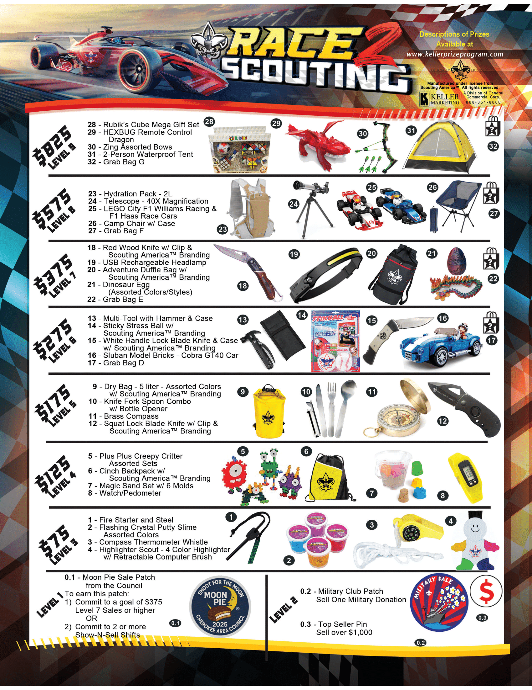
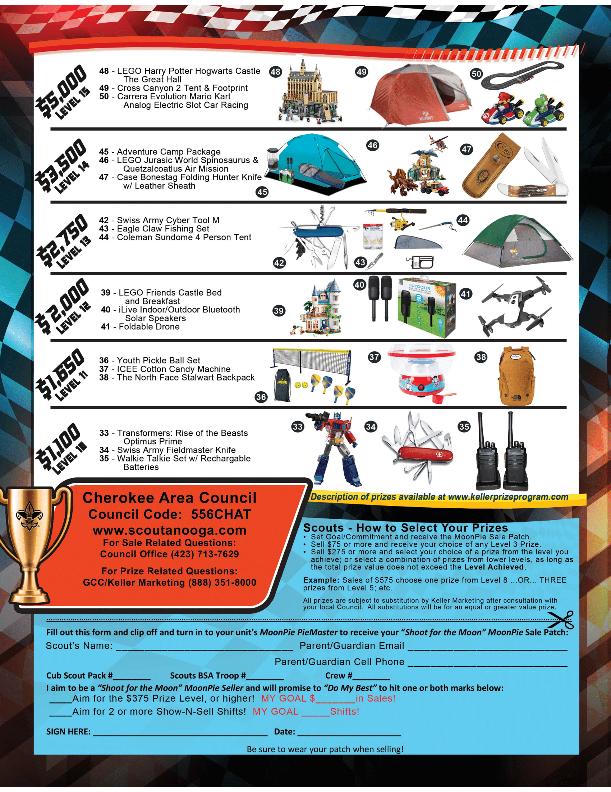

---
# Comment needed?

layout: home
title: Home
permalink: /
---

## Instructions for Cub Pack 3116 families for the Moon Pie Fundariser in Signal Mountain TN.

{: .center-image }
 

{: .center-image }

## Sales goal 
Sales goal per Cub Scout is $400. 
If you make the goal of $400, there are no pack fees for your Cub Scout in 2026/2027. 
If you don't make $400, then the Cub Scout pack fees will be pro-rated.

Total fees for 2026 are $225. $100 to the pack, $85 to National and $40 to Council.
{: .notice--success }

The fundraiser is beginning for 2026. 
{: .notice--success }

## For info on Show-n-Sell Sales
[Show-n-Sell](/shownsell)

## For info on Door to Door Sales
[Door to Door sales](/doortodoor)

Please make sure the Scouts full name is provided at checkout to be sure the amount is credited towards their goal.

{: .center-image }

## Prizes your Cub can earn

{: .center-image }
 
{: .center-image }

